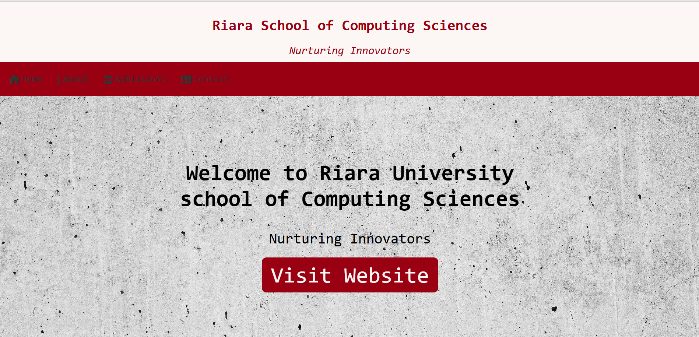

# University-portfolio
# 🎓 Riara School of Computing Sciences - Website

A simple and visually appealing website for the **Riara School of Computing Sciences**. This project was created as part of a **Web App Development** course, focusing on user-friendly design and responsiveness.

## 🚀 Features
- 📌 **Sticky Navbar with Shrinking Effect** – Smoothly shrinks on scroll for better user experience.
- 🌆 **Banner Section** – Includes a welcome message and university branding.
- 🏫 **About Section** – Highlights key computing programs.
- 🎨 **Modern UI Design** – Uses clean fonts, icons, and colors for a professional look.

## 🛠️ Technologies Used
- **HTML5** – Structuring the website content.
- **CSS3** – Styling, including navbar effects and responsive design.
- **JavaScript** – Interactive navbar shrinking effect.
- **Font Awesome** – Icons for better visual appeal.

## 📂 Project Structure
/project-root │── images/ # Contains images used in the project │── index.html # Main website file │── style.css # Styling for all sections │── README.md # Project documentation (this file)

## 🖥️ Live Demo (Optional)
You can check out the live version of this project **[here](https://gabriel-bjay.github.io/University-portfolio/)**.

## 📌 Installation & Usage
1. Clone the repository:
   ```bash
   git clone https://github.com/Gabriel-Bjay/University-portfolio.git
2. Open the index.html file in a browser.


## 📸 Preview



## 📩 Contributing
Feel free to contribute! If you’d like to improve this project:

Fork the repo.

Create a new branch (git checkout -b feature-branch).

Make changes and commit (git commit -m "Your message").

Push to the branch (git push origin feature-branch).

Open a Pull Request.

## 📜 License
This project is for educational purposes. Feel free to modify and use it as a reference.
